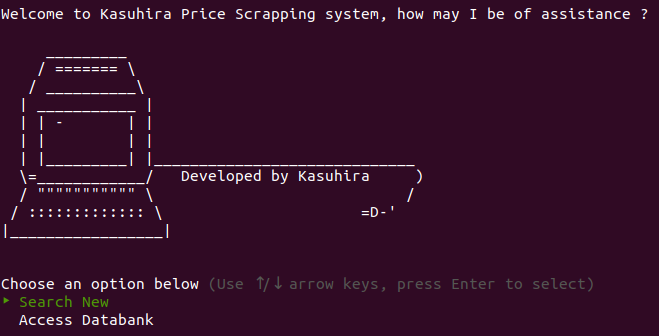
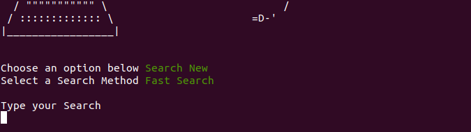
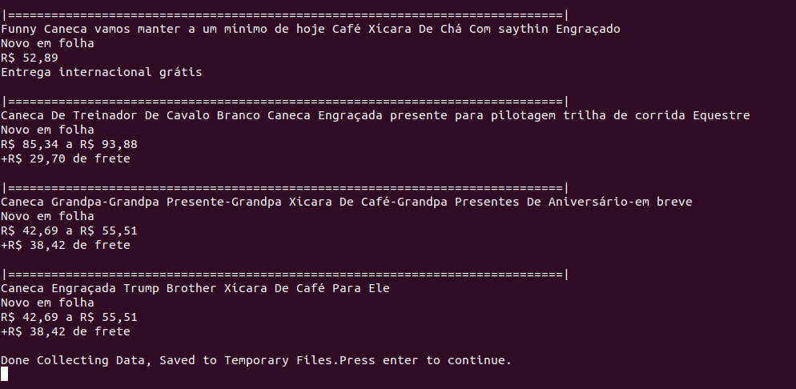
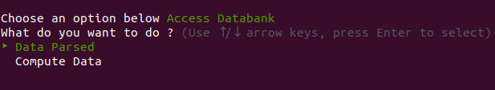
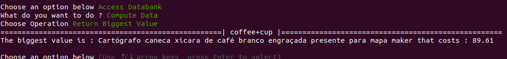
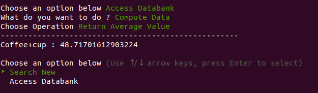

# KScrapper web Scrapper

<p align="center">

<br>
<h3 align="center"> This is the Capstone project of Ruby Section </h3>
<a href="https://github.com/Kasuhira/Microverse-Project-Web-Scrapper/issues"> Request Feature </a> 
</p>

## Contents
  * [About the Project](#about-the-project)

## About the Project 

The objective of this project is to create a scraper developed in Ruby, so I focused the program to scrap prices of things in e-bay, those things can be whatever you want to type in the program searcher. Thanks to [TTY_Prompt](https://github.com/piotrmurach/tty-prompt) I was able to make a more user-friendly program.<br>
As all capstone projects In microverse, the due time is 3 working days, but I will continue working on it afterwards because it turned out to be something really interesting.

## Getting Started

To get a local copy up and running follow these simple steps :

1. Clone or fork the <a href="https://github.com/Kasuhira/Microverse-Project-Web-Scrapper">repo</a> [https://github.com/Kasuhira/Microverse-Project-Web-Scrapper.git]

2. Ruby needs to be installed to run the code [check here](https://www.ruby-lang.org/en/documentation/installation/) for further steps

3. Navigate to the project's root folder and run: 
    ```
    $ ruby /bin/main.rb
    ```
    for example:
    ```
    > $ ./bin/main.rb
    ```
    <i>Note:</i> The file should have executable     permissions:
    ```
    > $ chmod +x bin/main.rb
    ```
    Or you can run it using the ***ruby***     command:
    ```
    > $ ruby bin/main.rb example.css

## How to Use
<p align="center">
<h2 align="center"> Gattering Data </h2>
<ol>
<li>When Executing the program this screen under will appear</li>

<br>
 <li align="left">The "Search New" option will redirect you to a sub-menu, wich displays 'Fast Search' and 'Custom Search'. </li>
 <br>
 <ul>
  <li>Fast Search Is to search for keywords, without any aditional parameter</li>
  <li>Custom search, wich <strong>Has not been implemented yet</strong> weill take parameters, like rating, views, pricing, etc. And apply to the search.
 </ul>
 <br>
 <li>The 'Access Databank' option leads to the data you will gatter In 'Search New', and will allow you to to a series of commands with the data you gathered.</li> 
 <br>
 <li>After you enter in the 'Fast Search', It will require an input of what you want to search(and can be bought), like the screen below. </li>
  
 <br>
 <br>
 <li> This Search must begin with a letter, if blank, special character and numbers in the beginning will return an error and ask to type again.<br>
 After an valid search is typed, it will return a number of results.
 <br>
 <br>
 
 <br><br>
 <li>In the screen above, the search will be displayed in n itens, each one displays:
 <ul>
 <li> Name of the product </li>
 <li> Status (if it's new or used)</li>
 <li> The price or the average price</li>
 <li> The price of the delivery</li>
 <li> Some extra data that sometimes display how many bought or how many are watching it</li>
 </ul>
 <br>
 <li> After every search the data is stored in temporary databanks to use in the 'Access Databanks' option</li>
 </p>
 </ol>
</p>

<h2 align='center'> Using the Data</h2>
<ol>
<li> To use the data select the 'Access Databank', it will open the screen :
<br><br>

<br><br>
<li> This screen displays 2 options:</li>
<ul>
<li> Data Parsed will redirect you to options that will show all the data you gattered</li>
<li> The compute Data will lead to another screen that will ask for you to make one of three operations that are self-descriptive.</li>
</ul>
<br>
<li> The Final result is accumulative, all searchs you do along the program will show in the end as results.</li>
<figure>

<caption>If you search for 'coffee cup' and select the 'Return Biggest Value' it will retrieve the most expensive item of the list and it's name, like the example above</caption>
<br>
<br>

<caption> Similarly to the other example, if you compute the average, it will return the result above</caption>
</figure>
<br>
</ol>


## Built With
* [Ruby](https://ruby-doc.org/core-2.7.0/)
* [Nokogiri](https://nokogiri.org/)
* [RestClient](https://github.com/rest-client/rest-client)
* [Open_Uri](https://ruby-doc.org/stdlib-2.6.3/libdoc/open-uri/rdoc/OpenURI.html)
* [TTY_Prompt](https://github.com/piotrmurach/tty-prompt)

## Future Updates

This project will have future updates to enlarge the program usefulnes, like adding parameters, saving data permanently, multiple websites checkup, etc.
The beta will be released feb/2/2019.

## Contributing

Contributions are what make the open source community such an amazing place to be learn, inspire, and create. Any contributions you make are **greatly appreciated**.

1. Fork the Project

2. Create your Feature Branch (`git checkout -b feature/AmazingFeature`)

3. Commit your Changes (`git commit -m 'Add some AmazingFeature'`)

4. Push to the Branch (`git push origin feature/AmazingFeature`)

5. Open a Pull Request

## License

No licenses required as project was developed in educational eviroment.

## Contact

Henrique Hefler - [@hheflerdevelop1](https://twitter.com/hheflerdevelop1) - hheflerdevelopment@gmail.com 

## Acknowledgements

* [Henrique Hefler](https://github.com/Kasuhira)